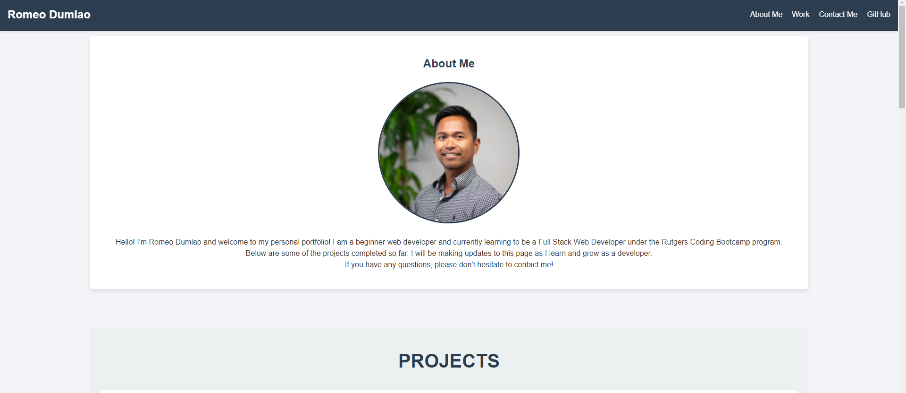

# Personal-Portfolio

## Description

In this portfolio, you'll find a range of projects that demonstrate my growing skills in HTML, CSS, JavaScript, and various other web development technologies. Each project included here is a testament to my commitment to learning and my passion for technology.

## Technologies

- HTML, CSS

## Features

- **Responsive Design**: Crafted to provide an optimal viewing experience across a range of devices.
- **Interactive Projects Section**:Highlights the projects I've worked on, including detailed descriptions and links to live versions and source code.
- **About Me**: A section detailing my background, skills, and educational journey in web development.
- **Contact Information**: Easy ways to reach out to me for collaborations or inquiries.
## Installation
N/A

## Usage
### Navigating the Portfolio

My personal portfolio is designed to be intuitive and user-friendly. Here's how you can navigate and explore my work:

#### Home Page: As you enter the portfolio, you'll be greeted with a brief introduction and my latest projects.

#### About Me Section: Learn more about my background, the journey in web development, and the skills I have acquired.

#### Projects Section:

Each project is displayed with a brief description and a screenshot.
Click on the project title or screenshot to view the live project or its GitHub repository for more details and source code.
Contact Information: At the bottom of the portfolio, you will find my contact details. Feel free to reach out for collaborations or queries.

### Viewing Projects
To view a project:

Click on the image or title of any project. This will redirect you to a page where you can see the live project or its GitHub repository.
On the project's page, detailed information about the project, including its purpose, technologies used, and challenges faced, are provided.

## Deployment
This application is deployed using GitHub and can be accessed at [Personal-Portfolio](https://romeocd.github.io/personal-portfolio/)

## Contributors

- Romeo Dumlao (https://github.com/romeocd)

## Tests
N/A

## Questions
Please feel free to reach out with any questions, feedback, or issues via our [Issues Page](https://github.com/romeocd/personal-portfolio/issues), or contact me directly:

- Romeo Dumlao rdumlao07@gmail.com

## License

This project is licensed under the [MIT License](LICENSE).

## Screenshot

